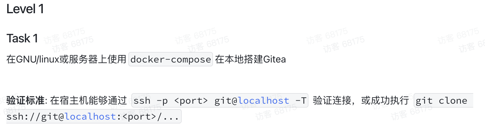
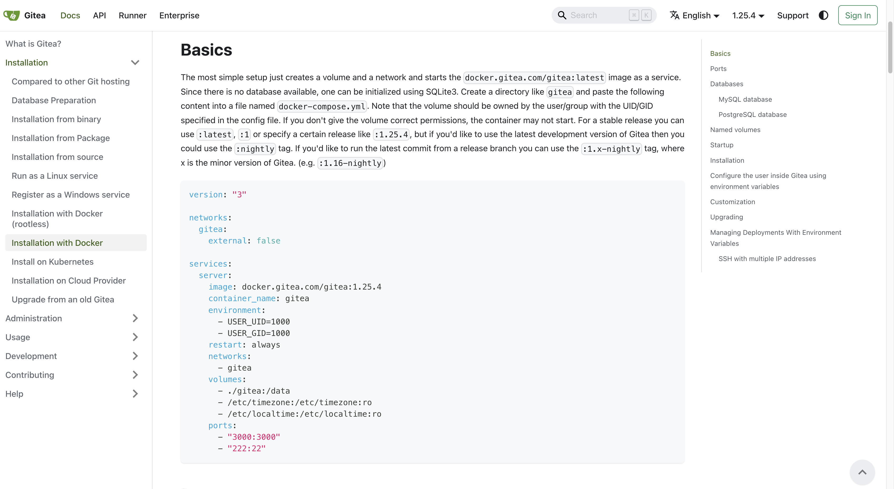
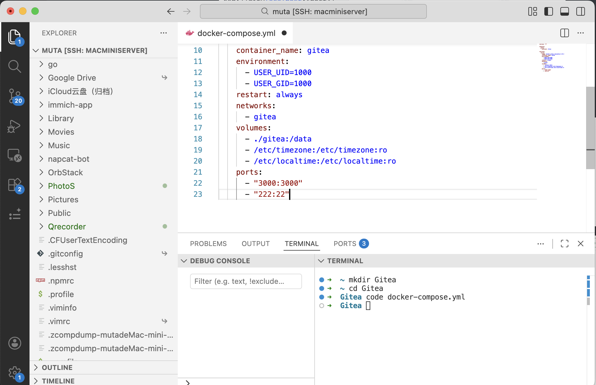
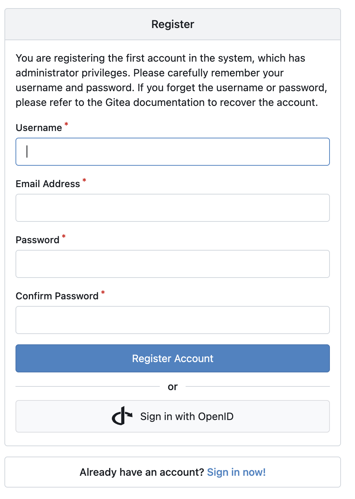
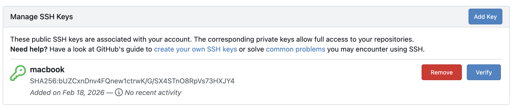
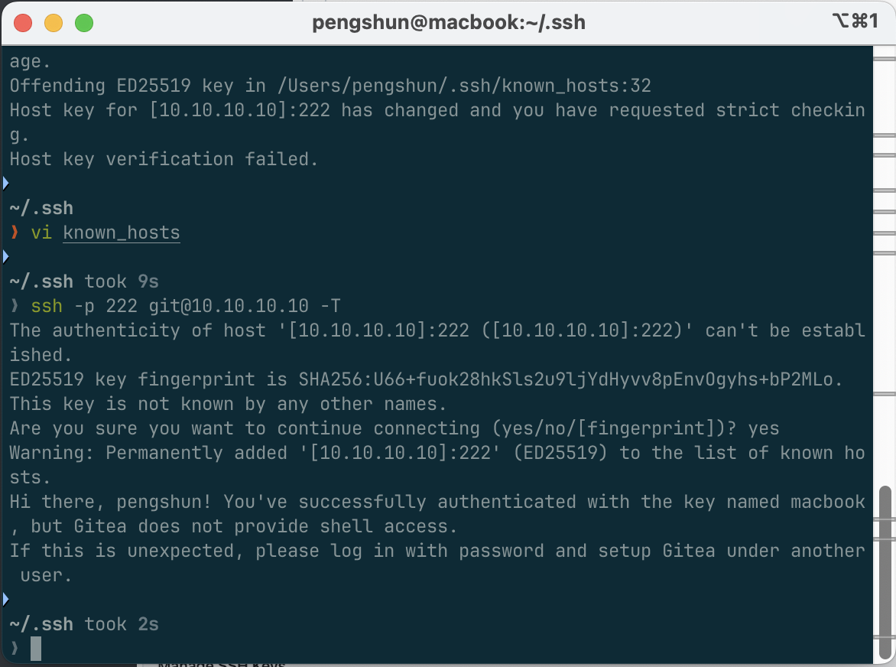
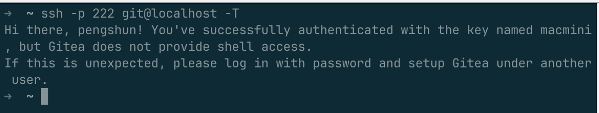

# Task1

我的思路: 

1. 找相关的 `docker-compose.yml` 

   

   

   

2. 复制 `Basic` 中内容, 连接到主机, 创建对应文件.

   

3. 去根据网站进行修改docker-copmose.yml, 配置, 添加本机公钥

   

   

   4. 成功

      
      
      或宿主机
   

