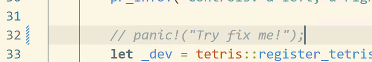
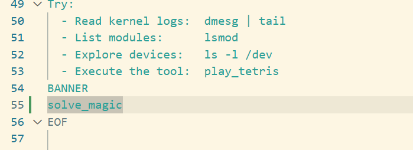
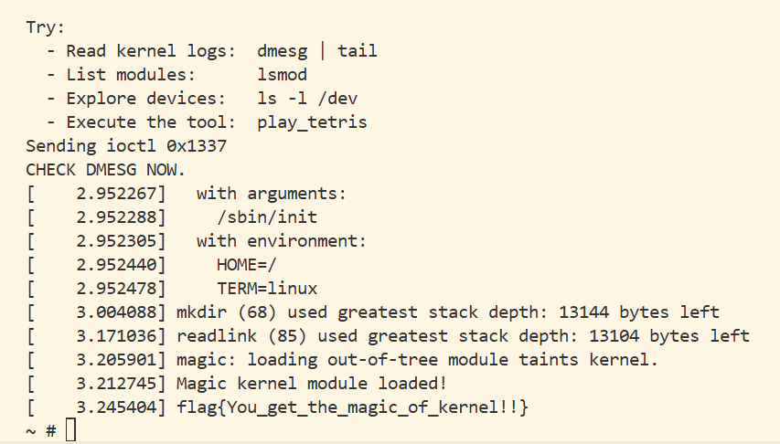
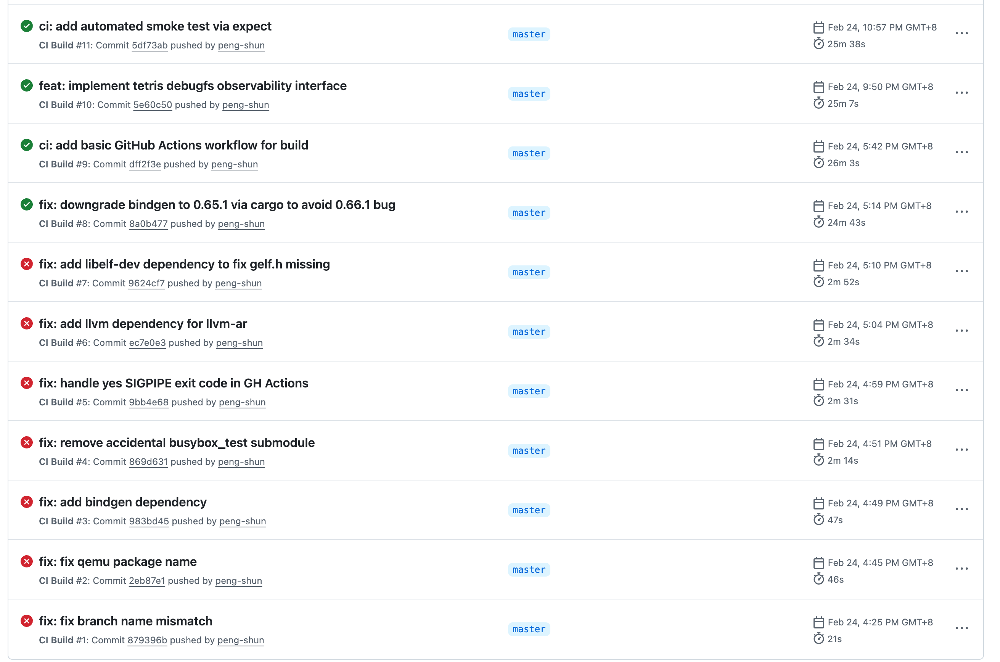
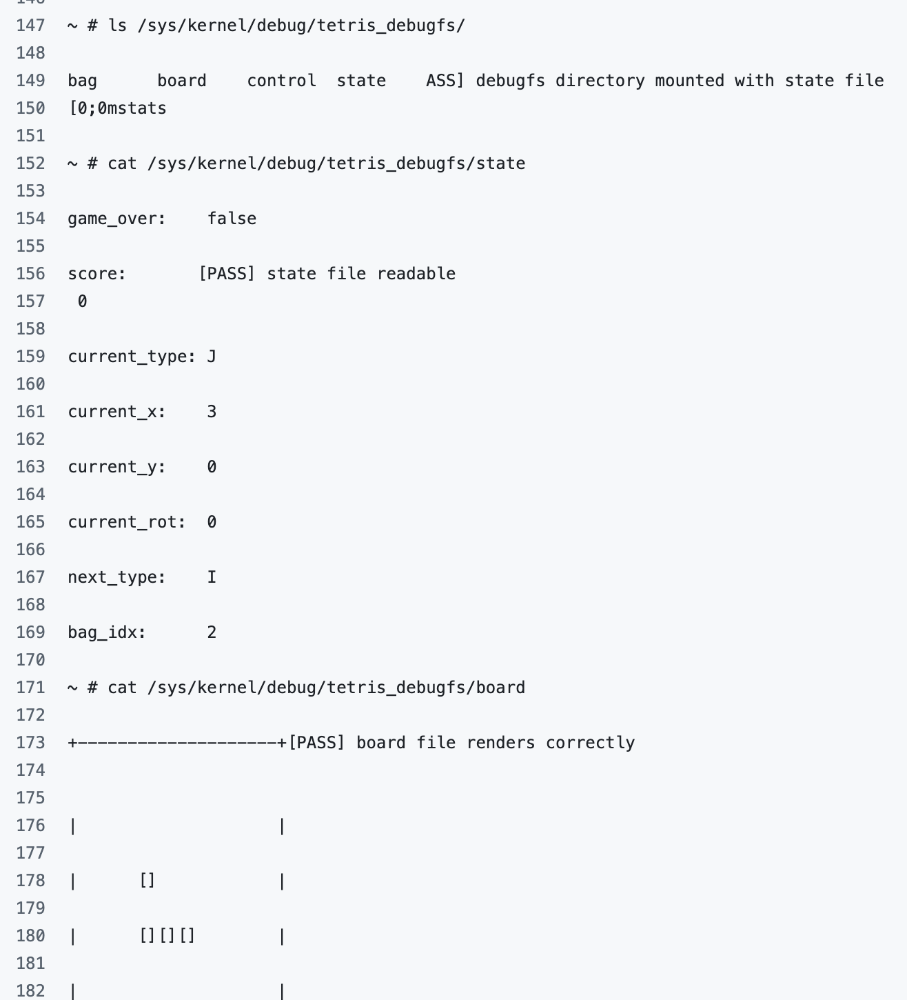
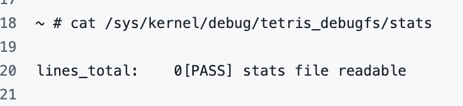

# Task2

## 任务1

1. 搭建环境

2. ```bash
   play_tetris
   ```

   Failed to open /dev/tetris: No such file or directory

   Please load the kernel module first:
     insmod /lib/modules/woc2026_hello_from_skm.ko

3. ```bash
   insmod /lib/modules/woc2026_hello_from_skm.ko
   ```

   [  328.452052] rust_kernel: panicked at module.rs:32:9:
   [  328.452052] Try fix me!

   ...

4. 查看 `module.rs`

5. 注释`panic!("Try fix me!");`

6. 重启QEMU后`insmod`不再报错



## 任务2

我想我没有找到 `magic` 或 `magic.c` , 在 github上也是如此. 

1. 我猜测他可能在git里. 

​	找了一段时间, 并没有发现. 

2. ```bash
   strings src/magic.ko
   ```

   输出了一些特定的文本内容, 如 `6Magic kernel module loaded!`, `6flag{You_get_the_magic_of_kernel!!}` .

   注意到 `printk()` 日志级别中 `#define KERN_INFO "\x06"`, `"\x0N"` N在0-7`strings`直接输出对应数字. 

   结合`6`处于开头, 这是一个`KERN_INFO`

3. 意识到这似乎是需要使用`ioctl`与驱动交互, 然后驱动会在内核日志中打印信息. 需要写一个用户态程序能用`ioctl`与驱动交互. 

4. ```c
   //
   // src/solve_magic.c
   //
   
   #include <stdio.h>  // perror
   #include <stdlib.h> // system 执行 shell 命令
   #include <fcntl.h>  // open
   #include <unistd.h> // close
   #include <sys/ioctl.h>  // ioctl
   #include <errno.h>  // errno
   
   #define MAGIC_DEV "/dev/magic"
   #define MAGIC_CMD 0x1337
   
   int main() {
       int fd = open(MAGIC_DEV, O_RDWR);
       if (fd < 0) {
           perror("Failed to open /dev/magic");
           return 1;
       }
   
       printf("Sending ioctl 0x%x \n", MAGIC_CMD);
       if (ioctl(fd, MAGIC_CMD, 0) < 0) {
           perror("ioctl failed");
           close(fd);
           return 1;
       }
   
       printf("CHECK DMESG NOW.\n");
       close(fd);
       
       system("dmesg | tail -n 10");
       return 0;
   }
   ```

5. 虚拟机上似乎不具有clang, gcc. 我可能需要寻找某种交叉编译器, 在外部获取虚拟机的可执行程序. 我需要寻找虚拟机与主机传递文件的方式. 或许可以通过挂载主机文件系统到虚拟机来解决. 

   我发现可以直接通过修改 `Makefile` 改动rootfs的打包过程, 让虚拟机启动时带有自己的程序.

   ```make
   # ...
   tools: $(TDIR)/$(USERSPACE_PROG).c src/solve_magic.c
   	@echo "Building userspace program..."
   	@gcc -static -o $(TDIR)/$(USERSPACE_PROG).a $(TDIR)/$(USERSPACE_PROG).c -Wall -Wextra
   	@clang -static -o src/solve_magic.out src/solve_magic.c -Wall -Wextra
   tools-clean:
   	@echo "Cleaning userspace program..."
   	@rm -f $(TDIR)/$(USERSPACE_PROG).a src/solve_magic.out
   
   tools-install: tools
   	@echo "Installing userspace tools..."
   	@cp $(TDIR)/$(USERSPACE_PROG).a $(BUSYBOX_INSTALL)/bin/$(USERSPACE_PROG)
   	@cp $(TDIR)/$(USERSPACE_PROG).a $(BUSYBOX_INSTALL)/usr/bin/$(USERSPACE_PROG)
   	@cp src/solve_magic.out $(BUSYBOX_INSTALL)/bin/solve_magic 
   	@touch $(ROOTFS_STAMP)
   # ...
   ```

   同时开机自启, 在`config-rootfs.sh`中添加

   

   ```bash
   ./scripts/config-rootfs.sh -b ./busybox
   make run
   ```

   

   ## 任务3

   ### CI
   
   详见 https://github.com/peng-shun/woc2026-hello-from-skm/actions
   
   

### smoketest

对任务4的`debugfs`部分:

1. 检查 `debugfs` board的框输出



2. 检查其他各种驱动文字等. 

   

详情可见

https://github.com/peng-shun/woc2026-hello-from-skm/actions/runs/22357679500/job/64701845115

### docker镜像

可见于: (ghcr)

https://github.com/peng-shun/woc2026-hello-from-skm/pkgs/container/woc2026-hello-from-skm

## 任务4

详见`TETRIS_DEBUGFS.md`

## 杂项改进

完成了 

- kvm开关 https://github.com/peng-shun/woc2026-hello-from-skm/commit/69b67f7c1d4a8d44bdd32d4d79eb52475ee96de3
- 本地冒烟: 在 https://github.com/peng-shun/woc2026-hello-from-skm/commit/5df73ab1b205ebe13774bd66b0eb2f79e260cdce 后可通过 `make test`一键冒烟.
- fmt+linter: https://github.com/peng-shun/woc2026-hello-from-skm/commit/26847956fdc4cd5631e587e6dc0ba53469ee95a3

ioctl 命令魔数头文件绑定没有太多使用, 未提交.
