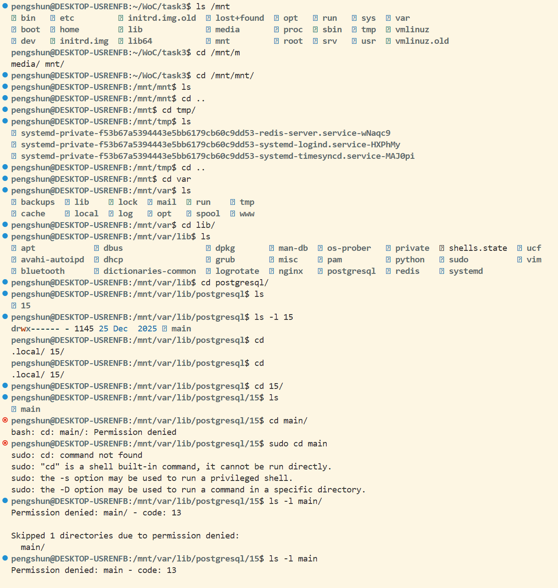
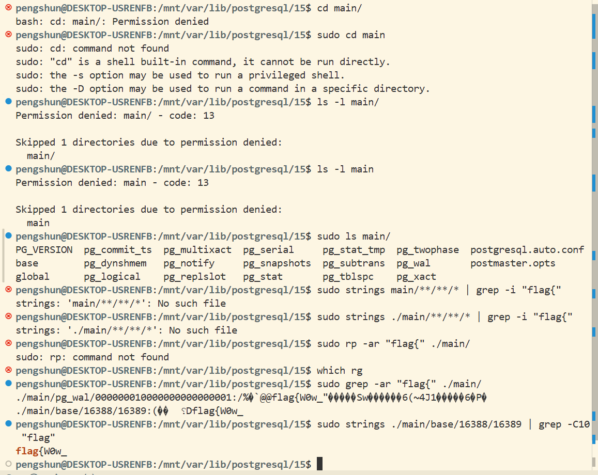
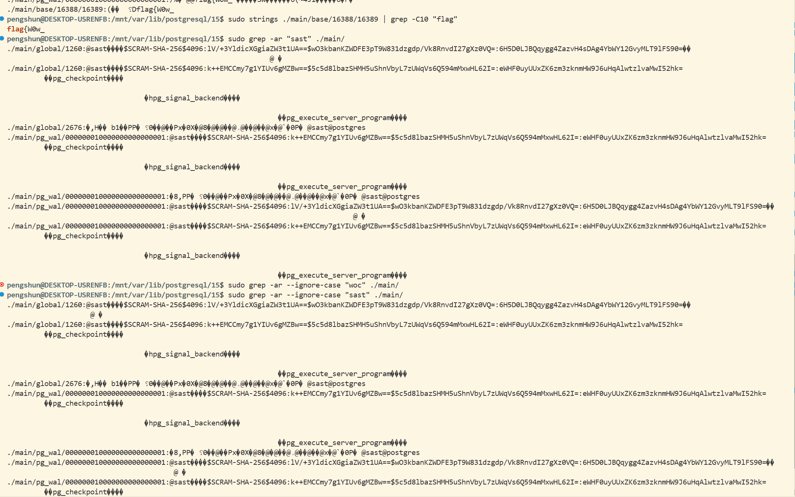
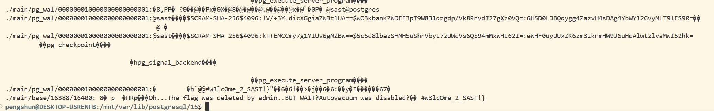
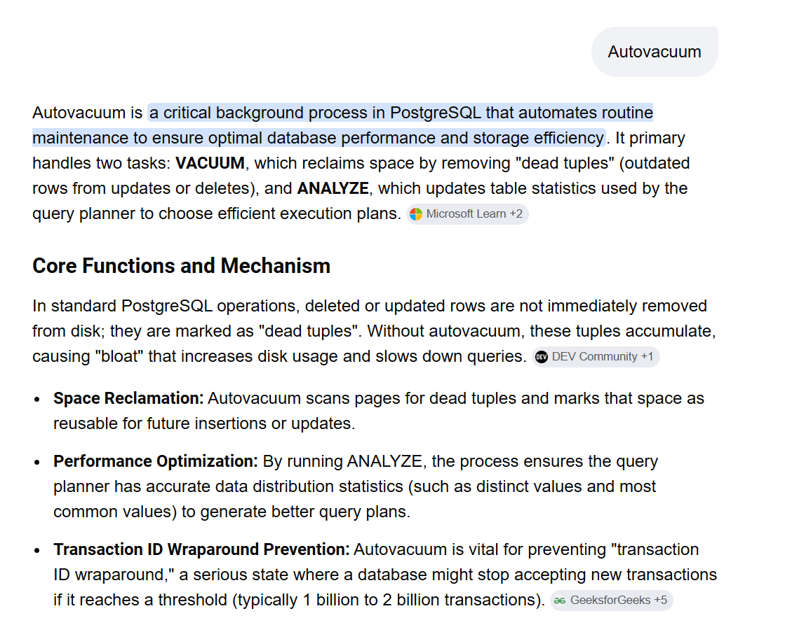
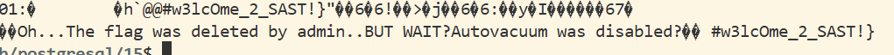
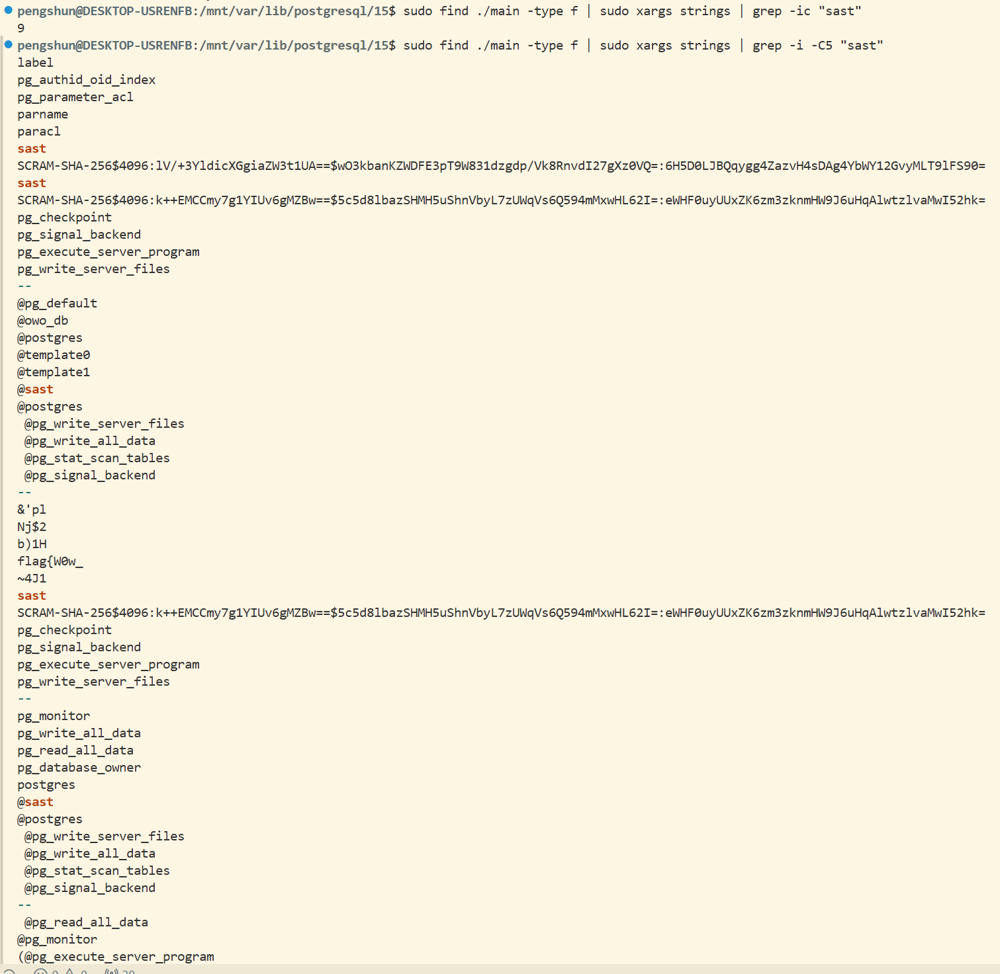
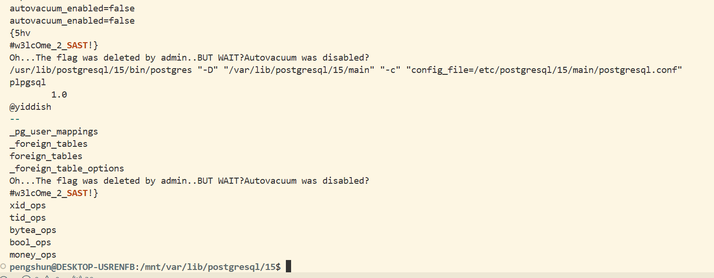
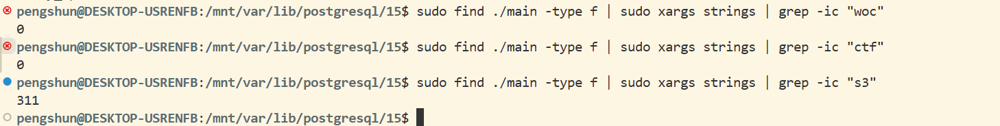
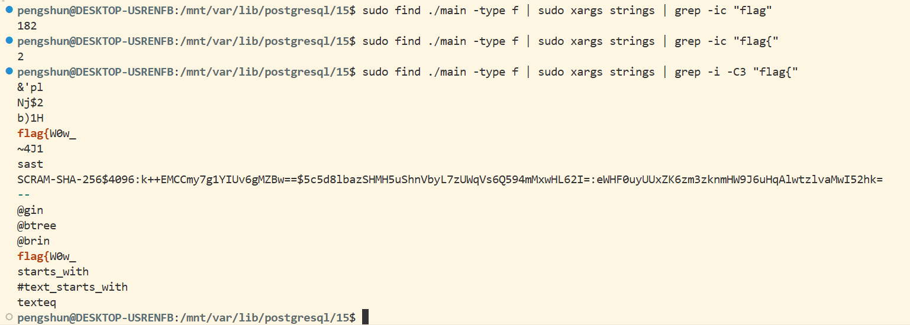

# Task 3

这是一个镜像文件, 要直接读取其中内容. 

`PostgreSQL` 数据通常在: `/var/lib/postgresql/<版本>/main/`

```bash
tar -xvf linux-WoC.ova
```

得到 `.vmdk`

使用 `libguestfs-tools`

`wsl` 没有 `vmlinuz`, 使用 `qmeu-utils`

第一分区开始于2048扇区. 

```bash
sudo mount -o loop,offset=1048576 disk.raw /mnt
```











大意: 这个`Autovacuum`进程有清理功能, 没有他那所有被删除的数据(dead tuples)就会保持被存留. 



`admin` 删除的flag被保存了下来.

可能中间还有别的字? 这样并不严谨. 

刚才的`strings`用不了.

```bash
sudo find ./main -type f | sudo xargs strings
```

输出了约 5 s的信息. 考虑可能会插入3, 2, 0, #等, 没有太大意义. 









我愿意相信那是最终答案:

# `flag{W0w_#w3lcOme_2_SAST!}`

 