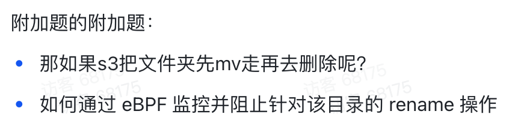
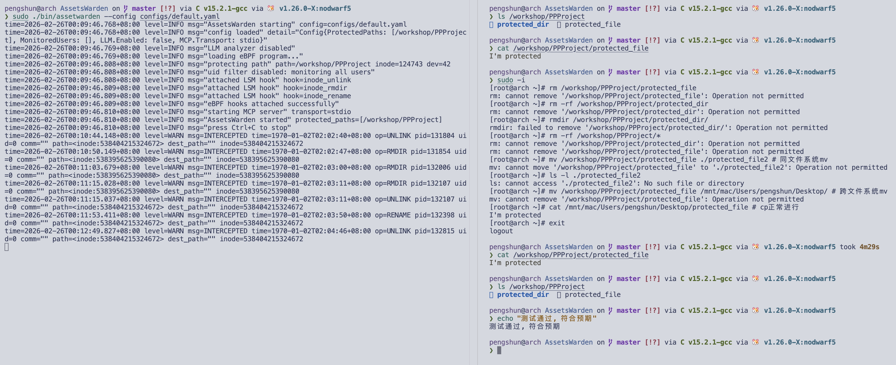

# task 5 - WriteUp

不了解eBPF相关概念, 让我先做了解

似乎使用python bcc比较简单. 那提供了一些宏和方法, 帮助展开为完整代码并编译为eBPF字节码后加载入内核. 但功能受限且加载慢. 打算先使用来了解相关概念

了解eBPF可以在`sys_enter_execve`的`tracepoint`被触发时执行一些代码, 获取相关的上下文信息:

- `sys_enter_execve` 是一个`tracepoint`, 在每次有execve的syscall时被触发
- 触发的结果是执行挂载在其上的函数
- 函数能获取触发execve上下文, 通过某隐藏参数的形式

execve上下文里会包含fd和将要被替换的程序, 如果那是`s3`使用shell执行的结果的话. 同时会不会能看到某种表示user的信息? -> 可以提取uid发送给用户态程序, 转为字符串用户名, 单一对某个用户名的特定操作检查(如`s3`)

在bcc中, 具体挂载方式是使用bcc提供的一些宏如`TRACEPOINT_PROBE`, 并使用一些特定的方法. 

c的eBPF程序可以通过一些特定的代码与python交流数据. 这样可以专注于设计判断合法性的逻辑. 

让我来记录一些我的想法:

在bash中执行rm是先fork bash, 此时更改文件描述符, 把其中某个文件描述符指向目的文件类, 然后execve替换程序. 这其中我们的判断程序是在execve上发生.  在sys_enter_execve中捕捉到rm操作-获取rm目的对象的文件描述符对应文件-传递到python层做判断-执行或拦截

**`rm` 删除对象是通过命令行参数指定的, 而非文件描述符** 

忽略以上的fd. ~~不过似乎具体mv在执行时也会以fd为目的文件~~

具体判断: 

- 简单: 如果路径就是`/workshop/PPProject/*`, 直接拦截 - 可以直接在eBPF里完成?

- 复杂 (附加部分):

  - first glance - 整活版:

    调用语言生成模型api, 传入设计的判断提示词和上下文 并 抓取, 注入用户的最近操作. 

    根据模型返回的结构化输出打印阻断信息并执行阻断操作 - 寻找某种让进程等待的操作

  - 逻辑:

    寻找不变量 (对mv操作不敏感的文件独特标识) 判断 - inode不变吗? -> 不完全是

    - 在同一文件系统的情况, 不变, 可以直接拦截

    - crossfs会变. 

      但是! 题目针对的是 `mv` 我认为完全可以实现某种算法, 通过多次使用 `history | grep "mv" | ...` 并对其输出进行处理, 完全可以通过字符查找链式地跟踪原文件最终停留为什么, 并使用最后停留的结果为依据做出判断, 这甚至包含所有情况. 

      ​	也可以直接监听所有的mv操作在用户态维护追踪, rm触发判断

      ​		同时这个方案与整活版不冲突, 完全可以作为更精准的上下文来源 -> 可以做一个mcp! 

      ​		不妨来设计一个更有意思的东西.

似乎所有判断逻辑都会涉及到较底层的执行顺序, 如何让进程挂起等判断, 以及如何拦截. 

这些两边具体的实现可能会很复杂. 

符合进程挂起等待的: seccomp-notify (gVisor使用的机制!)

---

了解发现. 实际上. `mv` 方法是`rename`和`unlink`系列syscalls的组合.

简单理解为: 同fs是`renameat2`, 跨fs是copy+delete, delete会有`unlinkat`. 

同时, `rm`删除机制是使用`unlink`类syscall. 如`-r`会使用一些其他调用遍历目录.

需要注意, `rm` 在需要删除一个空目录时, 会调用`rmdir`: 这本身是一个syscall.

完全根据题目的语义, 具有前提:

1. **不被删除**

2. **不可以禁止移动目录**(位置的改变, or, **允许在新位置出现**: 因为真正移过去就被删除了.)
3. 但是可以阻止`rename`(系)操作 (开始没有了解`rename`是syscall)

这样, 拆解:

- 直接删除:
  - 对于`rm`: 阻止`unlink`类和`rmdir`系统调用.

- 同文件系统`mv`: 
  - `mv` 必然调用 `rename`类syscall. 题目允许直接阻止相关操作. 如 `renameat2`(3.15+)
- 跨文件系统`mv`:
  1. `copy`: 使用`read`, `write`或其他复制到另一个文件系统. 无影响不管
  2. 确认复制成功, 调用`unlink`类syscall删除原文件 -> 此时已有的前两层系统已可以拦截. 

原以为这是个开放的创意题目. 我真的挺想把我那个文件追踪的东西做出来的.

### AssetsWarden

验证:

通过. 

目前仅验证基础功能. 运行于macos内虚拟机, mcp等功能需要配置网络环境.

https://github.com/peng-shun/AssetsWarden

